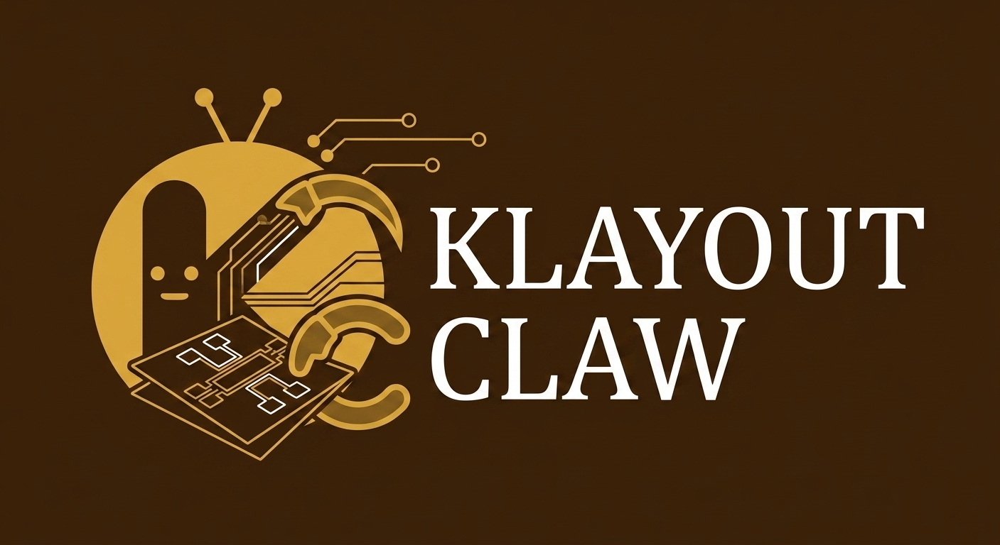

<p align="center">
  
</p>

# KlayoutClaw

[](https://www.python.org/downloads/)
[](https://modelcontextprotocol.io/)
[](LICENSE)

AI-powered layout design platform for KLayout. Connects your agent (Claude Code, Codex, Cline, or any MCP client) to your desktop KLayout through the [Model Context Protocol](https://modelcontextprotocol.io/), and ships Claude Code skills for geometry creation, layer display, visual capture, and nanodevice fabrication pipelines.

Built for device physicists working on 2D material devices, superconducting qubits, photonics, and other micro/nanofabricated systems.

> **macOS only** for now. Linux/Windows support is planned but untested. We need more help with Windows/Linux Native user and more benchmark test.


### Full End-to-End Demo

A full autonomous run of the nanodevice fabrication pipeline on a real van der Waals heterostructure sample: load a GDS template, overlay flake detection results from the `flakedetect` and `gdsalign` pipelines, generate a Hall bar, and route every pin to bonding pads using multi-window routing — all driven by one agent prompt.

https://github.com/user-attachments/assets/8d615606-082a-4204-b7ef-fff0b4a1a830

> Video not rendering on your client? The uncompressed copy lives at [`docs/Demo.mp4`](docs/Demo.mp4).

## What's Inside

KlayoutClaw has four layers:

| Layer | What it does |
|-------|-------------|
| **MCP Server** | KLayout autorun macro — JSON-RPC 2.0 server on `127.0.0.1:8765`. 10 tools: create layouts, run pya scripts, save GDS/OASIS, capture screenshots, autoroute pin pairs, inspect route metadata, evaluate designs, validate pixel size, close layout tabs. Zero external dependencies. |
| **Skills** | Claude Code plugin with 9 skills — geometry, display, visual, image, klayout_gds_import, and 4 nanodevice skills (flakedetect, gdsalign, routing, e2e_design). Claude loads them automatically when relevant. |
| **Qlaybot Agent** | Standalone TypeScript AI agent (`agent/`, v0.4.2) wrapping Pi-Agent SDK with its own KLayout MCP client (auto-launches KLayout on macOS/Linux/Windows). Interactive Ink/React TUI, 10 slash commands + interactive Config Panel, planning sandbox, role-based subagent delegation, categorized memory with FTS5 + optional vector search & reranker (4 search modes), 3-phase context compaction, background task support, and a JSON-RPC mode for integration / E2E testing. |
| **Tools** | Standalone utilities — GDS-to-PNG converter, subprocess routing engine. Used by the MCP server and skills internally. |

```
  Any MCP client                              KLayout GUI
  (Claude / Codex / …)                        + KlayoutClaw plugin
┌──────────────────┐   HTTP/JSON-RPC 2.0   ┌──────────────────┐
│                  │ ◄───────────────────► │                  │
│  Claude Code     │   127.0.0.1:8765/mcp  │  pya.QTcpServer  │
│  + Skills plugin │                       │  (Qt main thread) │
│                  │                       │                  │
└──────────────────┘                       └──────────────────┘

  Qlaybot (agent/)                            KLayout GUI
┌──────────────────┐   HTTP/JSON-RPC 2.0   ┌──────────────────┐
│  Ink/React TUI   │ ◄───────────────────► │                  │
│  Pi-Agent SDK    │   127.0.0.1:8765/mcp  │  pya.QTcpServer  │
│  SQLite memory   │                       │  (Qt main thread) │
│  Plan / Compact  │                       │                  │
└──────────────────┘                       └──────────────────┘
```

## Quick Start

```bash
# 1. Clone
git clone https://github.com/caidish/KlayoutClaw.git
cd KlayoutClaw

# 2. Install plugin into KLayout
python install.py

# 3. Launch KLayout
open /Applications/klayout.app

# 4. Test the connection
python tests/test_connection.py
```

## MCP Tools

| Tool | Description |
|------|-------------|
| `create_layout` | Create a new layout with a top cell |
| `execute_script` | Run arbitrary Python/pya code in KLayout |
| `save_layout` | Save layout as GDS2 or OASIS |
| `get_layout_info` | Get layout summary (cells, layers, dbu/um bboxes) |
| `screenshot` | Capture viewport as PNG, optional `zoom_box` in µm |
| `auto_route` | Autoroute pin pairs (Hungarian + Dijkstra). Supports `dry_run` preview, `pin_pairs_override` for manual pairing, `per_pair_obstacle_layers`, `auto_map_resolution` |
| `route_inspect` | Per-route metadata (contact, pad, length, crossings) on a given layer; `route_id` cross-refs `evaluate_design.crossing_pairs` |
| `evaluate_design` | Evaluate device design against configurable check primitives (`bulk_containment`, `arm_material_class`, `material_overlap_report`, `contact_isolation`, `connectivity`, `route_endpoints`, …) with `next_step_suggestion` hints |
| `validate_pixel_size` | Validate microscope pixel size against known objective mappings |
| `close_layout_view` | Close layout tabs by index or mode (current/others/all) — server health |

`execute_script` is the power tool — it runs any Python code inside KLayout with access to `pya`, the current layout, and view. The other tools handle lifecycle and visualization. See [docs/tools.md](docs/tools.md) for full parameter schemas.

### Autorouter

`auto_route` automatically connects pin pairs using Hungarian matching and cost-based pathfinding. It runs as a subprocess with numpy/scipy/scikit-image, supporting obstacle avoidance, configurable path spacing, and graduated damping cost fields.

For dense layouts where Hungarian matching assigns pins the wrong way, call `auto_route(dry_run=true)` first to see the `pairs[]` assignment, then re-call with `pin_pairs_override=[[a_idx, b_idx], ...]` to force the correct pairing. See [docs/tools.md](docs/tools.md) for tuning parameters.

### Example: Create a rectangle via MCP

```python
import json, urllib.request

def mcp(method, params=None, req_id=1):
    payload = {"jsonrpc": "2.0", "id": req_id, "method": method}
    if params: payload["params"] = params
    req = urllib.request.Request("http://127.0.0.1:8765/mcp",
        data=json.dumps(payload).encode(),
        headers={"Content-Type": "application/json"}, method="POST")
    return json.loads(urllib.request.urlopen(req).read())

# Initialize + create layout
mcp("initialize", {"protocolVersion": "2025-03-26", "capabilities": {},
    "clientInfo": {"name": "example", "version": "0.1"}})
mcp("tools/call", {"name": "create_layout", "arguments": {"name": "TOP"}}, 2)

# Draw a 100x50um rectangle on layer 1/0
mcp("tools/call", {"name": "execute_script", "arguments": {"code": """
dbu = _layout.dbu
li = _layout.layer(1, 0)
_top_cell.shapes(li).insert(pya.Box(int(-50/dbu), int(-25/dbu), int(50/dbu), int(25/dbu)))
result = {"status": "ok", "shape": "rectangle"}
"""}}, 3)

# Save
mcp("tools/call", {"name": "save_layout",
    "arguments": {"filepath": "/tmp/example.gds"}}, 4)
```

## Dependencies & Conda Environment

The MCP server itself has **zero external dependencies** — Python stdlib + KLayout's bundled `pya` only. The server runs inside KLayout's Python, so you don't need to install anything extra just to talk to it.

The subprocess tools (`auto_route`, `evaluate_design`) and the nanodevice skill scripts (flakedetect, gdsalign, routing) do need a standard scientific Python stack. We recommend creating a dedicated conda env named **`instrMCPdev`** — both MCP tools default to this env name, and every skill's SKILL.md references it. Portable one-liner:

```bash
conda create -n instrMCPdev python=3.11 -y
conda activate instrMCPdev

pip install \
    numpy scipy \
    scikit-image scikit-learn \
    opencv-python-headless \
    gdstk shapely \
    matplotlib \
    klayout==0.30.3
```

| Tool / skill family | Imports (subprocess) |
|----|----|
| `auto_route` → `tools/route_worker.py` | numpy, scipy, scikit-image, klayout |
| `evaluate_design` → `tools/evaluate_worker.py` | gdstk, shapely, numpy |
| `visual` → `tools/gds_to_image.py` | gdstk, matplotlib, numpy |
| `nanodevice_flakedetect*` | opencv-python-headless, numpy, scipy, scikit-learn, shapely |
| `nanodevice_gdsalign` | gdstk, opencv-python-headless, numpy, scipy |

If you already have these packages in a differently-named env, pass `python_path=/path/to/your/envs/<name>/bin/python` when calling `auto_route` or `evaluate_design` — that bypasses conda activation entirely.

## Using with Claude Code

```bash
# Add KlayoutClaw as an MCP server
claude mcp add --transport http klayoutclaw http://127.0.0.1:8765/mcp

# Or use the config file
claude --mcp-config mcp_config.json
```

Then just ask Claude to create layouts:

> "Create a Hall bar device with a 100x25um graphene channel, 6 side probes, metal contacts, and bonding pads. Save it as hallbar.gds."

## Qlaybot Agent

Qlaybot (`agent/`, v0.4.2) is a self-contained TypeScript AI agent that wraps the Pi-Agent SDK and ships its own KLayout MCP client (HTTP JSON-RPC on `127.0.0.1:8765`). It's the "batteries-included" way to drive KLayout — no external MCP client setup required.

```bash
cd agent
npm install
npm run build
export ANTHROPIC_API_KEY=your_key_here
npm start          # Interactive TUI
```

First run creates `~/.qlaybot/` (config + workspace + memory + sessions). Use `qlaybot onboard` to (re)initialize or `qlaybot uninstall` to remove it. Qlaybot auto-launches KLayout if the MCP port isn't answering (`open /Applications/klayout.app` on macOS, `start klayout` on Windows, `klayout &` on Linux), then polls with exponential backoff (1s → 2s → 4s → 8s).

### CLI & modes

```bash
qlaybot                               # Interactive TUI (default)
qlaybot -m "add a 100x25um rectangle" # Single-shot JSON mode
qlaybot --mode rpc                    # JSON-RPC on stdin/stdout (integration / E2E)
qlaybot --plain                       # Plain readline (no Ink)

# Top-level flags
--model <provider/modelId>            # Override default model
--thinking <off|minimal|low|medium|high|xhigh>
--cwd <path>                          # Working directory

# Shell-mode subcommands (same names/args as TUI slash commands)
qlaybot model [show|set|list]
qlaybot mcp [status|tools|reconnect]
qlaybot config [show|set|reset]
qlaybot memory [show|search|clear]
qlaybot compact [instructions]
qlaybot tasks
qlaybot onboard | uninstall | help
```

After `npm link`, `qlaybot` becomes a global CLI from any directory.

### Commands

| Command | Description |
|---------|-------------|
| `/model [show\|set\|list]` | Switch active model; persists to `config/model.json`. Bare `/model` opens the Config Panel on the Models tab. |
| `/mcp [status\|tools\|reconnect]` | MCP server management. Bare `/mcp` opens the MCP tab of the Config Panel. |
| `/config [show\|set <k> <v>\|reset\|setup]` | Persisted config management. Bare `/config` opens the Config Panel (Settings tab); `/config setup` re-runs the interactive setup wizard with a config backup. |
| `/memory [show\|search <query>\|clear <category>]` | Memory inspection. Categories: `knowledge`, `procedures`, `preferences`, `log`. |
| `/plan [enter\|exit\|status]` | Planning sandbox — restricts tools to a read-only allowlist while reasoning. |
| `/compact [instructions]` | Trigger context compaction with KLayout-state preservation. |
| `/tasks` | Background task status + cancel support. |
| `/context` | Workspace file listing with live context-window usage. |
| `/help [command]` | Help. |
| `/exit` | Graceful shutdown (TUI only). |

### Planning Mode

`/plan` (or `/plan enter`) activates a sandbox that wraps every tool and rejects any call not on the allowlist. Currently allowed:

- `read` (filesystem read)
- `klayout_native_get_layout_info`
- `klayout_native_screenshot`
- `memory_save`, `memory_search`
- `delegate` (subagent handoff)

Everything else — `bash`, `write`, `edit`, `execute_script`, all geometry/display/image/nanodevice tools, `auto_route`, `save_layout`, … — returns a "blocked in plan mode" error until you run `/plan exit`.

### Subagents & search

- **Role-based subagents** (`src/subagent/`) with a `delegate` tool, per-role budgets (tokens + turns), concurrent execution, and a TUI inspector panel. Roles are defined in `config/settings.json` under `subagent.roles` and auto-inherit their parent's search mode.
- **Hybrid search** (`src/memory/`) with 4 modes set via `/config set search.mode <mode>`:
  - `fts5` (default, SQLite porter unicode61)
  - `fts5+rerank` (Haiku cross-encoder rerank)
  - `fts5+vector+rerank` (BM25 ∪ cosine, deduplicated, reranked)
  - `vector+rerank` (pure embedding search)
  - Embedding provider is any OpenAI-compatible endpoint, configured under `embedding.*`.

### TUI Shortcuts

| Key | Action |
|-----|--------|
| `Ctrl+T` | Toggle tool detail + thinking expansion |
| `Ctrl+W` | Toggle workspace panel |
| `Ctrl+G` | Toggle background task panel |
| `Ctrl+A` / `Ctrl+E` | Cursor to start / end of line |
| `Ctrl+D` | Delete forward |
| `↑/↓` | Command history / panel navigation |
| `Tab` | Cycle command completion |
| `Escape` | Abort agent / close panel |

### RPC mode

With `--mode rpc`, qlaybot speaks JSON-RPC 2.0 over stdin/stdout. Methods: `initialize`, `prompt`, `get_session_info` (returns `planMode`, `backgroundTasks`, `contextUsage`), `dispose`, `shutdown`. Events pushed to the client: `ready`, `prompt_start`, `content_delta`, `thinking`, `tool_use`, `tool_result`, `usage_update`, `error`. Slash commands work in RPC mode — `prompt` calls starting with `/` route to the CommandRegistry.

### Config

Runtime state lives at `~/.qlaybot/`:

| Path | Purpose |
|------|---------|
| `config/model.json` | Default model + thinking level + provider definitions |
| `config/mcp.json` | MCP server URLs, required flag, disabled tools |
| `config/settings.json` | Memory budget, compaction thresholds, TUI prefs, search + embedding, subagent roles |
| `auth.json`, `models.json` | Auth storage + model registry (written next to `config/`) |
| `workspace/` | Domain knowledge (SOUL.md, TOOLS.md, RULES.md) + compaction prompt template + subagent templates |
| `memory/` | Persistent categorized memory (knowledge / procedures / preferences / log) + SQLite FTS5 index |
| `sessions/` | JSONL session + interaction history |

### Testing

```bash
cd agent
npm test                  # All tests (auto-skips E2E if env unavailable)
npm run test:unit         # 588 unit tests across 12 files
npm run test:integration  # 95 integration tests across 3 files
npm run test:e2e          # 14 E2E tests (needs ANTHROPIC_API_KEY + KLayout)
```

**697 tests total / 16 files.** See [agent/README.md](agent/README.md) and [agent/CLAUDE.md](agent/CLAUDE.md) for the full reference.

## Skills (Claude Code Plugin)

KlayoutClaw is also a Claude Code plugin. Install it to get skills that Claude invokes automatically:

```bash
# Add the marketplace
/plugin marketplace add caidish/KlayoutClaw

# Install the plugin
/plugin install klayoutclaw@klayoutclaw
```

Or test locally during development:

```bash
claude --plugin-dir ./path/to/KlayoutClaw
```

### Available Skills

| Skill | Slash Command | Description |
|-------|---------------|-------------|
| `geometry` | `/klayoutclaw:geometry` | Create rectangles, polygons, paths, cells, and instances |
| `display` | `/klayoutclaw:display` | Toggle layer visibility, show/hide layers |
| `visual` | `/klayoutclaw:visual` | Capture layout as PNG for visual inspection |
| `image` | `/klayoutclaw:image` | Load reference images (microscope, SEM) as background overlay |
| `klayout_gds_import` | -- | Safe GDS import (flattens + merges top cells, avoids `Layout.read()` pitfalls) |
| `nanodevice_flakedetect` | -- | Detect vdW heterostructure material boundaries (hBN, graphene, graphite) from optical images |
| `nanodevice_gdsalign` | -- | Align GDS templates to microscope images using lithographic marker detection |
| `nanodevice_routing` | -- | Place bonding pads and autoroute connections between device features |
| `nanodevice_e2e_design` | -- | Device-agnostic end-to-end orchestrator (QUERY → PREPARE → ANALYZE → DESIGN → ROUTE → EVALUATE → SAVE) |

Claude loads these skills automatically when relevant (e.g., "draw a rectangle" triggers the geometry skill).

See [docs/skills.md](docs/skills.md) for full reference.

### Nanodevice Skills

Agent-orchestrated pipelines for semiconductor/2D-material device fabrication workflows:

**flakedetect** -- Identifies material boundaries in van der Waals heterostructure stacks from optical microscope images. 5 stages: cross-substrate alignment (SIFT + Chamfer), per-material segmentation (graphite, graphene, top/bottom hBN), coordinate transforms + overlay, polygon commit to KLayout, and visual review.

**gdsalign** -- Aligns GDS lithography templates to microscope images. Extracts marker pairs from GDS, template-matches them in the image, computes a similarity transform, and warps contours into GDS coordinates.

**routing** -- Multi-window EBL routing. Places bonding pads around the field perimeter with pin markers, then runs two-pass routing (inner fine + outer coarse + boundary patches) to connect device features to pads.

## UI Plugin

The UI plugin (`klayoutclaw_ui.lym`) adds a status indicator and command history panel to KLayout -- no source modifications needed.

- **Status bar**: Shows `MCP: Running ● :8765` in green when active
- **Dock panel**: Scrollable command history with timestamps and pass/fail indicators

See [docs/ui-plugin.md](docs/ui-plugin.md) for details.

## Project Structure

```
KlayoutClaw/
├── .claude-plugin/
│   ├── plugin.json               # Claude Code plugin manifest
│   └── marketplace.json          # Claude Code marketplace catalog
├── plugin/
│   ├── klayoutclaw_server.lym    # MCP server (v0.6)
│   └── klayoutclaw_ui.lym        # UI panel + status bar
├── agent/                        # qlaybot v0.4.2 — standalone TypeScript agent
│   ├── src/
│   │   ├── cli.ts                # Entry point (interactive / json / rpc / slash)
│   │   ├── agent.ts              # createDesignSession(), 3-phase transformContext pipeline
│   │   ├── config.ts             # QlayBotConfig + ~/.qlaybot layout + resolveModel
│   │   ├── setup.ts              # Interactive setup wizard + config backup
│   │   ├── rpc.ts                # JSON-RPC server (initialize / prompt / get_session_info / dispose / shutdown)
│   │   ├── events.ts             # Session event subscribers
│   │   ├── history.ts            # InteractionHistory (session JSONL)
│   │   ├── context.ts            # Workspace context loader
│   │   ├── commands/             # CommandRegistry + 10 command handlers
│   │   ├── planning/             # PlanManager + sandbox tool wrapper (allowlist)
│   │   ├── background/           # BackgroundTaskManager with cancel()
│   │   ├── compaction/           # tool-result-pruner, state-extractor, state-loader, prompt-loader
│   │   ├── subagent/             # Role resolver, runner, tool factory, transcript
│   │   ├── mcp/                  # MCPManager + custom HTTP JSON-RPC client + transport
│   │   ├── memory/               # MemoryManager (FTS5 + vector search + reranker + auto-recall)
│   │   ├── prompts/              # System prompt builder (PromptMode.Full/…)
│   │   ├── tools/                # Base tools + KLayout native + domain (geometry/display/image/visual/nanodevice)
│   │   ├── tui/                  # Ink/React TUI (14 components + hooks + config panel + subagent panel)
│   │   └── types/                # v0.4 contracts (search modes, config schemas, embedder types)
│   ├── tests/                    # 697 tests: unit (588) / integration (95) / e2e (14)
│   ├── workspace/                # Domain knowledge (SOUL, TOOLS, RULES) + compaction + subagent templates
│   ├── package.json              # name: qlaybot, version: 0.4.2, bin: qlaybot
│   ├── README.md                 # Qlaybot user reference
│   ├── CLAUDE.md                 # Agent dev instructions
│   └── TODO.md                   # v0.1 → v0.4 roadmap
├── skills/                       # Claude Code skills (auto-loaded)
│   ├── scripts/mcp_client.py     # Shared MCP client
│   ├── geometry/                 # Shape creation skills
│   ├── display/                  # Layer visibility skills
│   ├── image/                    # Background image overlay skill
│   ├── visual/                   # Layout capture skill
│   ├── nanodevice_flakedetect/   # vdW heterostructure detection orchestrator
│   ├── nanodevice_flakedetect_*/# 5 sub-skills (align, detect, combine, commit, review)
│   ├── nanodevice_gdsalign/     # GDS template alignment
│   └── nanodevice_routing/      # Pad placement + autorouting
├── tools/
│   ├── gds_to_image.py           # GDS → PNG converter (gdstk + matplotlib)
│   ├── route_worker.py           # Subprocess routing engine (numpy/scipy/scikit-image)
│   └── evaluate_worker.py        # Subprocess design evaluator (gdstk/shapely/numpy)
├── tests/
│   ├── test_connection.py        # Protocol-level MCP test
│   ├── test_connection.sh        # E2E connection test (install + launch + verify)
│   ├── test_phase0_func.py       # Phase 0: connection + geometry functional
│   ├── test_phase0_mcp.py        # Phase 0: MCP protocol
│   ├── test_phase1_mcp.py        # Phase 1: LYM server MCP
│   ├── test_phase1_worker.py     # Phase 1: route/evaluate worker
│   ├── test_phase2_phase3_func.py # Phase 2-3: skills + flakedetect
│   ├── test_phase4_docs_integration.py # Phase 4: docs integration
│   ├── test_phase4_mcp.py        # Phase 4: GDS alignment + routing MCP
│   ├── test_e2e_regression.sh    # Full phase-by-phase E2E regression bundle
│   ├── test_e2e_alt_device.sh    # Alt-device full pipeline (de-overfit guard)
│   ├── test_e2e_crossing_pairs.sh # crossing_pairs end-to-end
│   ├── test_e2e_material_overlap.sh # material_overlap_report end-to-end
│   ├── test_e2e_route_override.sh # pin_pairs_override end-to-end
│   ├── test_e2e_non_hallbar.sh   # non-Hall-bar evaluate_design pipeline
│   ├── test_e2e_heavy_script.sh  # execute_script heavy-state regression
│   ├── create_hallbar.py         # Hall bar creation test
│   ├── create_hallbar_unrouted.py # Unrouted Hall bar (autorouter input)
│   ├── evaluate_gds.py           # Hall bar structural evaluation
│   ├── evaluate_routing.py       # Routing structural validation
│   ├── test_hallbar.sh           # E2E Hall bar test
│   └── test_autoroute.sh         # E2E autoroute test
├── tests_resources/              # Test fixtures
│   ├── graphene_for_test.jpg     # Graphene microscope image
│   └── ml08/                     # ML08 sample data
├── docs/
│   ├── tools.md                  # MCP tool reference (10 tools)
│   ├── skills.md                 # Skills reference (9 skills)
│   ├── ui-plugin.md              # UI plugin docs
│   ├── plans/                    # Architecture design docs
│   └── superpowers/              # Design specs and implementation plans
├── install.py                    # KLayout plugin installer
├── mcp_config.json               # MCP client config (HTTP, port 8765)
└── pyproject.toml                # pytest configuration
```

## Architecture

- **`pya.QTcpServer`** on Qt main thread -- no Python threads, no GIL issues
- **No external dependencies** for the server -- only Python stdlib + pya
- **JSON-RPC 2.0** over HTTP (plain JSON, no SSE)
- **`auto_route`** spawns a subprocess in the `instrMCPdev` conda env for heavy computation (numpy/scipy/scikit-image)
- **`evaluate_design`** also spawns a subprocess in `instrMCPdev` (gdstk + shapely + numpy)
- All pya calls execute on the main thread directly

See [docs/plans/](docs/plans/) for design decisions and the threading problem that led to this architecture.

## Tests

```bash
# Protocol-level connection test (requires KLayout running)
python tests/test_connection.py

# Create a Hall bar and verify structure
python tests/create_hallbar.py /tmp/hallbar.gds
python tests/evaluate_gds.py /tmp/hallbar.gds

# Autoroute test (needs conda env instrMCPdev)
bash tests/test_autoroute.sh

# Full E2E (installs plugin, launches KLayout, tests connection)
bash tests/test_connection.sh

# Phase-by-phase regression bundle (every phase E2E, sequential)
bash tests/test_e2e_regression.sh

# Functional MCP tests (requires KLayout + plugin running)
pytest -m mcp tests/ -v
```

## Community

Built for the device physics community. Interested in contributing? See [CONTRIBUTING.md](CONTRIBUTING.md) or contact **caidish1234@gmail.com**.

## Acknowledgments

The auto-routing engine (`tools/route_worker.py`) incorporates algorithmic techniques from [Klayout-Router](https://github.com/Legendrexial/Klayout-Router) by **Legendrexial** -- including graduated damping cost fields, pin-aware routing with per-pair recovery, and sorted routing order. Klayout-Router is licensed under the MIT License.

## License

MIT
