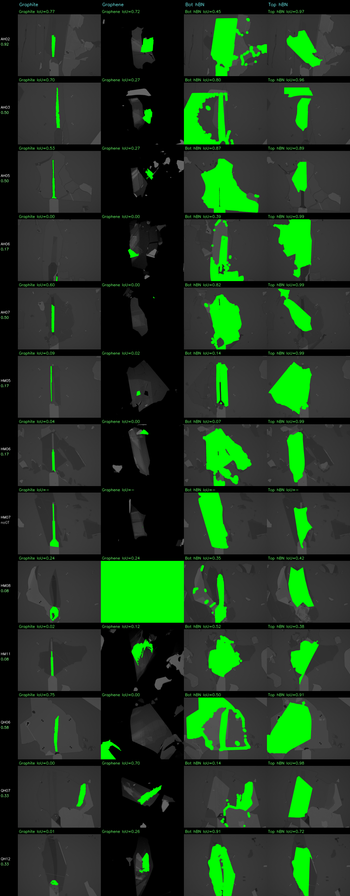

# Held-Out Generalization Panel — Phase 8

> Generated by `held_out_panel.py` · 358s wall clock

## Summary table

| Stack | Weighted GT | graphite IoU | graphene IoU | bottom_hbn IoU | top_hbn IoU | Notes |
|-------|------------|-------------|-------------|---------------|------------|-------|
| AH02 | 0.917 | 0.772 | 0.722 | 0.451 | 0.967 | ok |
| AH03 | 0.500 | 0.700 | 0.270 | 0.795 | 0.964 | ok |
| AH05 | 0.500 | 0.528 | 0.272 | 0.871 | 0.891 | ok |
| AH06 | 0.167 | 0.000 | 0.000 | 0.385 | 0.987 | ok |
| AH07 | 0.500 | 0.600 | 0.000 | 0.824 | 0.993 | ok |
| HM05 | 0.167 | 0.089 | 0.024 | 0.144 | 0.992 | ok |
| HM06 | 0.167 | 0.039 | 0.000 | 0.069 | 0.991 | ok |
| HM07 | — | — | — | — | — | GT score failed: combine/transform: exit 3
stderr:
ERROR: graphene: input had 106 px but was zeroed… |
| HM08 | 0.083 | 0.242 | 0.239 | 0.353 | 0.424 | ok |
| HM11 | 0.083 | 0.025 | 0.118 | 0.522 | 0.377 | ok |
| QH06 | 0.583 | 0.749 | 0.000 | 0.498 | 0.906 | ok |
| QH07 | 0.333 | 0.000 | 0.700 | 0.142 | 0.982 | ok |
| QH12 | 0.333 | 0.009 | 0.261 | 0.907 | 0.723 | ok |

## Scoring notes

- **Weighted GT**: `evaluate_flake_detect()` score from `detect_evaluator.py` (tiered IoU: 0=below 0.3, 1=0.3–0.5, 2=0.5–0.7, 3=above 0.7; normalized to [0, 1]).
- **Per-material IoU**: raw Jaccard index against `Aligned_Stack.gds` GT polygons.
- **top_hBN**: copies the footprint mask from the alignment step — IoU reflects alignment quality, not a separate detector.
- All stacks use `pixel_size = 0.106 µm/px` (100× objective, from alignment report).
- Phase 8 is **informational only** — no pass/fail threshold.

## Montage

